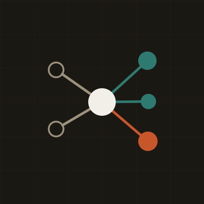
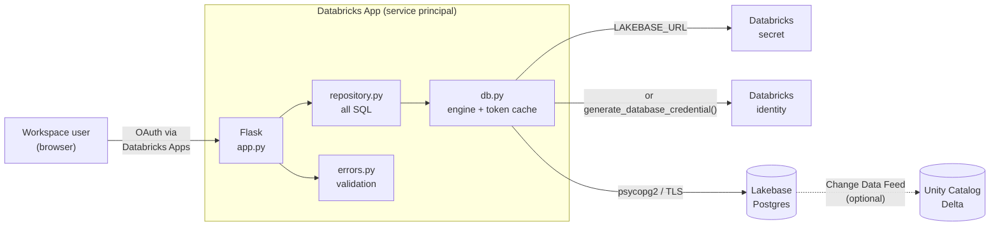
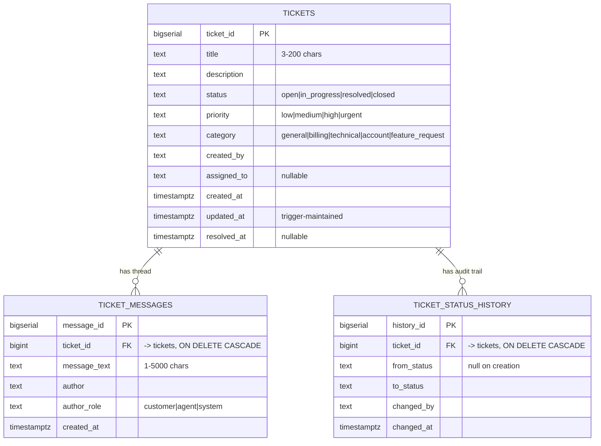

<div align="center">
  
  <h1>Nexus Support</h1>
  <p><strong>An internal support desk whose operational data lives in Databricks Lakebase.</strong></p>
  <p>
    Flask + vanilla JS &nbsp;·&nbsp; Lakebase (managed Postgres) &nbsp;·&nbsp;
    Deployed as a Databricks App &nbsp;·&nbsp; No stored database password
  </p>
</div>

---

Day 1 boot camp homework, built to be the foundation for the later
context-engineering and AI-agent work: every capability the UI has is also a
plain REST endpoint an agent can call.

## What it does

| Requirement | Where it lives |
| --- | --- |
| View all support tickets | Left panel, `GET /api/tickets` |
| Select a ticket and read its messages | Right panel, `GET /api/tickets/<id>` |
| Create a new ticket | **New ticket** modal, `POST /api/tickets` |
| Add a message to a ticket | Thread composer, `POST /api/tickets/<id>/messages` |
| Update a ticket's status | Status dropdown, `PATCH /api/tickets/<id>` |
| Reads and writes go to Lakebase | [`support_app/repository.py`](support_app/repository.py) — every read and write is SQL against Lakebase; nothing is held in app memory |

### Bonus challenges

| Bonus | How it is met |
| --- | --- |
| Ticket priority **and** category | `low/medium/high/urgent` and 5 categories, both enforced by `CHECK` constraints and editable in the detail pane. Priority also colours the accent bar on every ticket card. |
| Filtering by status | Multi-select status chips with live counts, plus priority, category, free-text search across titles *and* message bodies, and four sort orders. |
| Input validation and helpful errors | Validated in three layers — the browser, [`support_app/errors.py`](support_app/errors.py), and `CHECK` constraints in the schema. Every failure names the offending field with a specific message ("Title must be at least 3 characters (currently 2)."), and all problems are reported at once rather than one per attempt. |
| Ticket statistics | Six live tiles: total, open, in progress, resolved, high/urgent still active, and mean resolution time computed in SQL. |
| Delete with confirmation | Two-step: a modal that names the ticket and its message count, and requires typing `DELETE`. The FK cascade removes the thread with it. |
| Improved visual design | A small design system built from the product mark's own palette — see [Design](#design). |

Beyond the brief: an append-only `ticket_status_history` audit table, automatic
system messages when a status changes, a `/api/health` readiness probe, identity
taken from the signed-in Databricks user, and Change Data Feed readiness so the
same rows can flow into Unity Catalog.

## Screenshots

> Add your own after deploying — these paths are referenced by the submission checklist.

| | |
| --- | --- |
| `docs/screenshot-app.png` | The deployed application |
| `docs/screenshot-lakebase.png` | The Lakebase tables and sample records |

## Architecture



There are two supported ways to authenticate, and `LAKEBASE_URL` wins when both
are present:

1. **A connection string** you supply, read from a Databricks secret at runtime.
   Nothing is stored in the repo or in `app.yaml` — only the *name* of the secret
   resource is.
2. **No credential at all** — the app mints a short-lived Postgres token from its
   own service-principal identity on each new connection, caches it, and
   refreshes it eight minutes before expiry.

Either way the connection pool recycles below the credential lifetime, so a
pooled socket is never older than the credential that opened it. A connection
string with a user but *no* password is also valid: it supplies the host and
user, and the token supplies the secret.

## Data model



Defined in [`sql/001_schema.sql`](sql/001_schema.sql), seeded by
[`sql/002_seed.sql`](sql/002_seed.sql). Both are idempotent, so the app applies
them on every boot: the schema uses `IF NOT EXISTS` throughout, and the seed is
a single `DO` block that returns immediately if `tickets` already has rows.

The demo data is 6 tickets covering **all four statuses**, all four priorities
and all five categories, each with 2–3 messages — comfortably past the brief's
"3 tickets, 2 messages each, 2 statuses".

## Setup you still need to do

The code is finished. Everything below is yours, and none of it requires editing
source files.

> **The connection string is a credential.** It goes in two places only: a local
> `.env` (git-ignored) and a Databricks secret. Never in `app.yaml`, never in a
> commit, never pasted into a chat or an issue.

### Step 0 — Use a role password, not a token

This matters more than anything else here. Lakebase can give you two things that
both look like a connection string:

| Password is… | Lifetime | Use for this app? |
| --- | --- | --- |
| A generated **OAuth token** | ~1 hour | **No.** The app works, then starts failing after an hour. |
| A **native Postgres role** password | Until you rotate it | **Yes.** |

On the Lakebase instance page, enable native Postgres password authentication and
create a role with a password. Your connection string is then:

```
postgresql://<role>:<password>@<instance-name>.database.cloud.databricks.com:5432/databricks_postgres?sslmode=require
```

If the password contains any of `@ : / ? # %`, percent-encode it — `@`→`%40`,
`:`→`%3A`, `/`→`%2F`, `?`→`%3F`, `#`→`%23`, `%`→`%25`. An unencoded `@` is the
single most common cause of a confusing "authentication failed".

If you would rather not manage a password at all, skip to
[No connection string](#alternative-no-connection-string).

### Step 1 — Prove the connection works locally

Do this before deploying; it turns a deploy-loop debug into a 20-second one.

```powershell
cd lakebase-ai-support-app
python -m venv .venv
.venv\Scripts\activate
pip install -r requirements.txt
```

Create `.env` in the project root (it is git-ignored) containing one line:

```
LAKEBASE_URL=postgresql://<role>:<password>@<host>:5432/databricks_postgres?sslmode=require
```

Then:

```powershell
python scripts/check_connection.py
```

Read-only. It prints the host, database, role, `search_path`, whether the role
can create objects, and any tables that already exist — and never prints your
password. If your connection string is malformed it tells you which part is
wrong without echoing the value.

It also refuses to pass if a `tickets` table already exists in the target schema
with a *different* shape — say from earlier boot camp work. That case is worth
catching here, because `CREATE TABLE IF NOT EXISTS` would skip such a table
silently and you would instead meet it later as a missing-column error. The fix
it suggests is to set `LAKEBASE_SCHEMA` to a fresh name or drop the old schema.

### Step 2 — Create the schema and demo data

```powershell
python scripts/verify_lakebase.py
```

This creates the `support` schema, the three tables, the indexes and the trigger,
loads the 6 demo tickets, then runs the full end-to-end round trip: creates a
ticket, re-reads it on a fresh connection, adds messages, moves it through
statuses, checks the audit trail and the `updated_at` trigger, exercises every
filter and sort, validates the statistics arithmetic, then deletes its test
ticket and confirms the cascade. It cleans up after itself and leaves the demo
data in place.

Take your **Lakebase screenshot** now — the tables exist and have rows. The exact
queries to run are in [REFLECTION.md](REFLECTION.md#screenshots-worth-taking).

You can also run the app locally at this point to see it working before you
deploy:

```powershell
python app.py     # http://localhost:8000
```

### Step 3 — Store the connection string as a Databricks secret

```bash
databricks secrets create-scope nexus-support
databricks secrets put-secret nexus-support lakebase-url
```

The second command opens an editor (or reads stdin) so the value never appears in
your shell history. Verify it landed without printing it:

```bash
databricks secrets list-secrets nexus-support
```

### Step 4 — Push to GitHub and add a Git folder

```bash
cd lakebase-ai-support-app
git init
git add .
git commit -m "Nexus Support: Lakebase-backed support desk"
git remote add origin https://github.com/<you>/<repo>.git
git push -u origin main
```

Confirm `.env` is not in the commit — `git status --ignored` should list it as
ignored. Then in the workspace: **Workspace → Create → Git folder**, paste the
repository URL, clone.

### Step 5 — Create the app and attach the secret

**Compute → Apps → Create app → Custom**, with the source pointed at the Git
folder from step 4. Databricks reads [`app.yaml`](app.yaml) automatically.

Then, and this is the step that makes or breaks the deploy:
**Edit → Resources → Add resource → Secret**

| Field | Value |
| --- | --- |
| Scope | `nexus-support` |
| Key | `lakebase-url` |
| Resource key | `lakebase-url` — **must match** `valueFrom` in `app.yaml` |
| Permission | Can read |

`app.yaml` contains `valueFrom: lakebase-url`, which resolves to this resource.
If the resource key does not match, deployment fails with an unresolved-variable
error.

### Step 6 — Deploy and confirm

Hit **Deploy**. On first boot the app applies the schema (already a no-op after
step 2) and starts. Open the app URL — the header chip should read **Lakebase
connected**, and the footer should name your database, schema and host.

Then walk the four things the assignment asks you to confirm, and take your
**application screenshot** while a ticket is open:

1. Existing tickets load ✔ the list is populated on arrival
2. Create a ticket ✔ **New ticket**, fill in the title, submit
3. Add a message ✔ select a ticket, type in the composer, **Send message**
4. Change a status ✔ the **Status** dropdown in the detail pane
5. Refresh the browser ✔ all three changes are still there

If the chip reads **Lakebase unavailable**, the red banner and
`GET /api/health` name the exact cause. After fixing a resource binding you can
re-apply the schema without redeploying:

```bash
curl -X POST "https://<your-app-url>/api/admin/bootstrap?seed=true"
```

### Step 7 — Turn off reseeding (optional)

Once you are working with real tickets, set `LAKEBASE_SEED_ON_EMPTY` to `"false"`
in `app.yaml` and redeploy. Otherwise, if you ever delete every ticket, the demo
six come back on the next boot.

### Alternative: no connection string

If you would prefer the app to hold no password at all, delete the `LAKEBASE_URL`
entry from `app.yaml` and instead attach the Lakebase instance as a **Database**
resource (**Edit → Resources → Add resource → Database**, permission **Can
connect**). Databricks injects `PGHOST`/`PGPORT`/`PGDATABASE`/`PGUSER`/`PGSSLMODE`,
and the app mints its own short-lived token from its service principal. Steps 3
and 5's secret work then become unnecessary.

Honest status of this path: it is fully implemented, and its configuration,
precedence and instance-name derivation are covered by `check_api.py`. The
`generate_database_credential` call itself has had its signature verified against
the installed `databricks-sdk` (0.123.0) but has never been executed against a
live instance — the connection-string path is the one that has actually run. Keep
that in mind if you switch to it as a fallback.

## Local development

Covered by [Step 1](#step-1--prove-the-connection-works-locally): a venv, a
one-line `.env` holding `LAKEBASE_URL`, then `python app.py`. See
[env.example](env.example) for every recognised variable. `.env` is git-ignored;
the app reads it through `python-dotenv` only when running locally.

Local and deployed take the same code path — the only difference is where
`LAKEBASE_URL` comes from (`.env` vs. a Databricks secret).

## API

All responses are JSON. Errors always have the same shape, so a client — or an
agent — has exactly one failure branch to handle:

```json
{ "error": { "code": "validation_failed",
             "message": "Please correct the highlighted fields.",
             "fields": { "title": "Title must be at least 3 characters (currently 2)." } } }
```

| Method | Path | Purpose |
| --- | --- | --- |
| `GET` | `/` | The application |
| `GET` | `/healthz` | Liveness — never touches the database |
| `GET` | `/api/health` | Readiness — reports real Lakebase connectivity, `503` when degraded |
| `GET` | `/api/meta` | Statuses, priorities, categories, limits, current user |
| `GET` | `/api/stats` | Aggregate statistics |
| `GET` | `/api/tickets` | List. `status`, `priority`, `category` (repeatable or comma-separated), `q`, `assigned_to`, `created_by`, `sort`, `limit`, `offset` |
| `POST` | `/api/tickets` | Create, optionally with a first message |
| `GET` | `/api/tickets/<id>` | One ticket with its thread and status history |
| `PATCH` | `/api/tickets/<id>` | Partial update: title, description, status, priority, category, assigned_to |
| `DELETE` | `/api/tickets/<id>` | Delete; cascades to messages and history |
| `GET` | `/api/tickets/<id>/messages` | Thread only |
| `POST` | `/api/tickets/<id>/messages` | Add a message |
| `POST` | `/api/admin/bootstrap` | Re-apply the schema; `?seed=true` also loads demo rows |

Writes attribute themselves to the signed-in Databricks user, read from the
`X-Forwarded-Email` header that Databricks Apps supplies. `author_role: system`
is reserved for the app and rejected from clients.

## Verification

Four scripts. The first two need nothing but Python — no database, no running app:

```bash
python scripts/check_api.py         # 97 checks: routing, validation, DSN parsing, envelope
python scripts/check_sql.py         # 372 checks: every SQL statement, real PG parser
python scripts/check_connection.py  # read-only: can we reach Lakebase, and as whom
python scripts/verify_lakebase.py   # end-to-end round trip against live Lakebase
```

`check_sql.py` uses `pglast`, which wraps PostgreSQL's own parser
(libpg_query), so a pass means real Postgres accepts the grammar — including the
plpgsql inside the trigger and the seed block. It checks both SQL files, all 256
filter/sort permutations of the list query, all 95 UPDATE shapes the PATCH
endpoint can build, and every static query in `repository.py`. It also runs
negative controls, so a pass proves the checker can still detect broken SQL.

`check_api.py` also asserts the contract the frontend depends on — every non-2xx
response carries `error.code` and a specific `error.message`, so the banner and
toasts show *what* went wrong rather than a bare status code — and covers
connection-string parsing with synthetic values, including that a percent-encoded
password decodes correctly, that a malformed string is rejected without echoing
it, and that the password never appears in the `/api/health` output.

```bash
pip install pglast   # only needed for check_sql.py
```

## Design

The palette is lifted from the product mark rather than chosen alongside it —
warm near-black ground, cream hub, teal for routed states, orange for attention:

| Token | Value | Used for |
| --- | --- | --- |
| `--ink-800` | `#1a1813` | App ground, straight from the mark's background |
| `--cream` | `#f2efe9` | Primary text — the mark's central hub node |
| `--teal-500` | `#3e9a8d` | Primary action, resolved status, healthy connection |
| `--orange-500` | `#c8562b` | Open status, high priority — the mark's orange node |
| `--gold-500` | `#d9962b` | In-progress status |
| `--tan-500` | `#9c917c` | Secondary text — the mark's unrouted outline nodes |

Status colours follow the mark's own logic: orange for *needs attention*, gold
for *in flight*, teal for *routed and healthy*, muted tan for *settled*. The
64px grid behind the app is the grid inside the logo tile. Priority is encoded
twice over — a coloured accent bar on each card and a pill in the detail pane —
so it never depends on colour alone.

The interface is a two-pane workspace that collapses to a single column with a
back button under 1000px, keyboard-operable throughout (`Esc` closes modals,
`Ctrl`/`Cmd`+`Enter` sends a message), respects
`prefers-reduced-motion`, and keeps visible focus rings.

> **On the logo:** `static/img/logo.svg` is a vector rebuild of the supplied
> mark — sharp at any size, and the source of the palette above. To use the
> original raster instead, drop it in as `static/img/logo.png` and update the two
> `` tags in `templates/index.html`.

## Security notes

- **No credential in the repository or in `app.yaml`.** With the connection-string
  path, `app.yaml` holds only `valueFrom: lakebase-url` — the *name* of a secret
  resource, resolved at runtime. The value lives in a Databricks secret scope and
  in your local `.env`, nowhere else. With the Database-resource path there is no
  password at all: credentials are minted at runtime from the app's own OAuth
  identity.
- **`.env` is git-ignored**; `env.example` is the committed template and holds
  no values.
- **Errors never echo the credential.** A malformed connection string produces a
  message naming what is wrong (missing host, missing username, needs
  percent-encoding) without reproducing the string, and `/api/health` reports
  host, database, role, schema and auth mode but never the password. Both are
  asserted in `check_api.py`.
- **No string-formatted user input in SQL.** Every value is a bound parameter.
  The only things interpolated into SQL text are the schema name (validated
  against `^[a-z_][a-z0-9_]*$`), column names from a hard-coded whitelist, and
  `ORDER BY` fragments from a hard-coded map.
- **No user data reaches the DOM as markup.** The frontend builds nodes with
  `createElement`/`textContent` only, so a ticket titled `<script>…` renders as
  text.
- **`/api/health` is deliberately incomplete** — it reports host, database,
  schema and auth mode, and never a credential.

## Project layout

```
app.py                     entry point (waitress in production, Flask debug locally)
app.yaml                   Databricks Apps config -- no credentials
requirements.txt
env.example                local-dev template, no values

support_app/
  config.py                environment -> validated settings, domain vocabulary
  db.py                    token minting/caching, engine, idempotent bootstrap
  repository.py            every SQL statement in the app
  errors.py                error envelope + field validators
  routes.py                Flask blueprints (UI + JSON API)
  __init__.py              app factory, error handlers, boot migration

sql/
  001_schema.sql           tables, FK, indexes, trigger, view, CDF readiness
  002_seed.sql             idempotent demo data

static/
  css/app.css              the design system
  js/app.js                frontend, no build step, no dependencies
  img/                     logo.svg, logo-mark.svg, favicon.svg

scripts/
  check_api.py             offline route/validation/DSN-parsing checks
  check_sql.py             every SQL statement, against PostgreSQL's own parser
  check_connection.py      read-only connectivity diagnostic -- run this first
  verify_lakebase.py       end-to-end round trip against live Lakebase

templates/index.html
```

## Troubleshooting

| Symptom | Cause and fix |
| --- | --- |
| Deployment fails on an unresolved variable | The Secret resource key does not match `valueFrom: lakebase-url` in `app.yaml`. Both must be exactly `lakebase-url` (step 5). |
| Header reads *Lakebase unavailable* | Open `/api/health` — it names the cause. `No Lakebase connection is configured` means `LAKEBASE_URL` did not reach the app, i.e. the Secret resource is missing or misnamed. |
| `password authentication failed` | Almost always an unencoded special character in the password. Percent-encode `@ : / ? # %` (step 0). Re-test with `python scripts/check_connection.py`. |
| Worked at first, then broke about an hour later | The connection string's password is a short-lived OAuth token, not a native role password. Create a native Postgres role and re-store the secret (step 0). |
| `LAKEBASE_URL is not a valid Postgres connection string` | Missing scheme, host or username. It must start `postgresql://` and include `user@host`. `check_connection.py` says which part is wrong. |
| `permission denied for database` on first boot | The role cannot `CREATE`. Either grant it, or set `LAKEBASE_SCHEMA` to a schema it owns, or apply `sql/001_schema.sql` as an admin (replace `__SCHEMA__` with your schema name). |
| `column ... does not exist` at runtime | A `support` schema from earlier work already had a `tickets` table with a different shape, and `CREATE TABLE IF NOT EXISTS` skipped it silently. `check_connection.py` detects this and refuses to pass — set `LAKEBASE_SCHEMA` to a fresh name, or drop the old schema. |
| `Failed to mint a Lakebase credential` | Only on the no-connection-string path: the app's service principal lacks **Can connect** on the instance. Grant it on the Database resource. |
| App loads but no tickets | Bootstrap ran before the credential was available. `POST /api/admin/bootstrap?seed=true`. |
| Demo tickets reappear after deleting them | `LAKEBASE_SEED_ON_EMPTY` reseeds an empty table. Set it to `false` in `app.yaml` once you are using real data. |
| Want a clean database | `DROP SCHEMA support CASCADE;` then redeploy, or `POST /api/admin/bootstrap?seed=true`. |
| `psycopg2` build error locally | Install `psycopg2-binary` (already pinned in `requirements.txt`), not `psycopg2`. |
